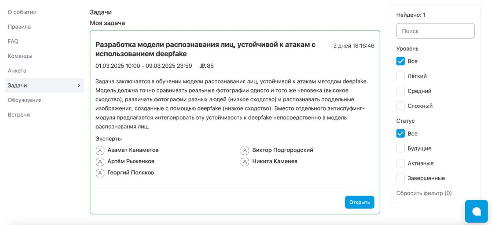
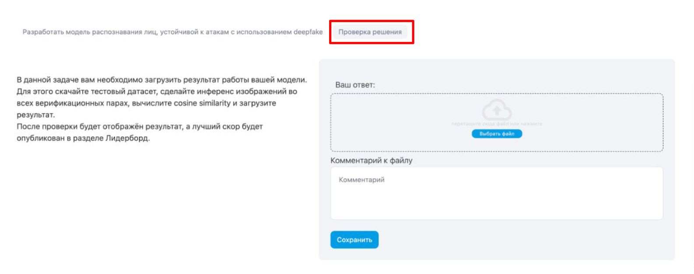

## Общее описание задачи

Целью хакатона является построения модели для построения эмбеддингов изображений лиц устойчивой к атакам, которые используют синтетические данные.


## Данные

Перед началом работы необходимо загрузить данные и разместить их в папке `data`. 

- **Данные для обучения**: [Скачать по ссылке](https://storage.codenrock.com/companies/codenrock-13/contests/kryptonite-ml-challenge/train.zip)
- **Данные для теста**: [Скачать по ссылке](https://storage.codenrock.com/companies/codenrock-13/contests/kryptonite-ml-challenge/test_public.zip)

1. Создайте папку `data` в корневой директории проекта.
2. Загрузите данные по указанным ссылкам.
3. Поместите загруженные файлы в папку `data`.

## Описание данных

Данные - реальные и синтетически сгенерированные изображения лиц расположены в папке `data`.

```
data
├── test_public  # тестовые данные
│   ├── 00000000    # pair_id - ID сравниваемой пары сообщений
│   │   ├── 0.jpg
│   │   └── 1.jpg
│   ├── 00000001
│   │   ├── 0.jpg
│   │   └── 1.jpg
...
└── train   # данные для обучения модели
│   ├── meta.json 
│   ├── images 
│   │   ├── 00000000    # label - ID человека
│   │   │   ├── 0.jpg
│   │   │   ├── 1.jpg
│   │   │   ├── 2.jpg
│   │   │  ...
│   │   │   └── k_0.jpg
│   │   ├── 00000001
│   │   │   ├── 0.jpg
│   │   │   ├── 1.jpg
│   │   │   ├── 2.jpg
│   │   │  ...
│   │   │   └── k_1.jpg
...
```

meta.json имеет структуру face_index/i.jpg : is_deepfake. Ключ содержит информацию о индексе человека и номере изображения, значение равно 0 для реальных данных и равно 1 для синтетических данных. 

### Структура submission.csv

submission.csv - это файл формата ".csv" с разделителем ",", который содержит две колонки:

- `pair_id` - название директории, в которой расположена пара сравниваемых изображений
- `similarity` - характеристика похожести двух изображений в виде произвольного вещественного числа


Пример файла (в `./data/sample_submission.csv`):
```
pair_id,similarity
00000000,1.0
00000001,0.9999271
00000002,0.99991727
```


## Бейзлайн решение

### Окружение
Версия Python: `Python 3.10.12`.
  
Создание окружения:

```bash
VENV_DIR="../../venvs/hakathon_kryptonite"
python3 -m virtualenv $VENV_DIR
source $VENV_DIR/bin/activate

pip install -r requirements.txt
```


Минимальные требования:

1 GB VRAM - inference

6 GB VRAM - train

### Запуск скриптов


0. Убедитель, что таблицы с разметкой train.csv, val.csv, test.csv находятся в репозитории


1. Обучаем модель.
**Модель обучается локально!**

```bash
python train.py
```

2. Формируем `submission.csv` с использованием построенной модели.
**Сабмит формируется локально!**

```
python make_submission.py 
```

## Целевая метрика

Error equal rate - https://www.innovatrics.com/glossary/equal-error-rate-eer/.

Код для вычисления метрики:
```py
import numpy as np
from sklearn.metrics import roc_curve

def compute_eer(y_true, y_score):
    fpr, tpr, threshold = roc_curve(y_true, y_score)

    # заменяем np.inf на max + eps
    eps = 1e-3
    threshold[0] = max(threshold[1:]) + eps

    fnr = 1 - tpr
    eer_index = np.nanargmin(np.absolute((fnr - fpr)))
    eer = fnr[eer_index]
    return eer
```

## Инструкция по загрузке решения на площадку

1. **Открыть задачу.**  
   

2. **Выбрать раздел "Проверка решения".**  
     
   

3. **Загрузить решение.**  
   

4. **Посчитанная метрика придет оповещением на почту.**  
   После успешной загрузки решения, результаты проверки будут отправлены вам на почту.